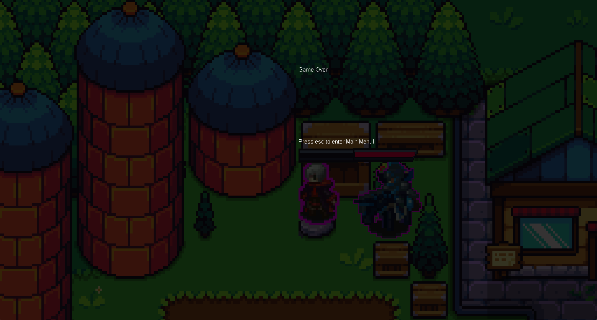

# Java RogueLike Game

## Objectives
- This game involves controlling a main character to 
defeat multiple enemies that follow them around the map 
- After defeating all the enemies on the map, the game can be 
replayed with increased difficulty by pressing the **+** button 
on the title screen
## Main Character

## Enemies

## Controls 
- W key: moves the character up 
- A key: moves the character left
- S key: moves the character down
- D key: moves the character right 
- Left-click the mouse: character attacks the enemies 
- ESC key: pauses the game in the playing state

## How to Start the Game

- Locate the *Main.java* file in src/main/ui/Main.java and run the *Main* function

## Title Screen

- You can start the game by pressing **Start** 
  - **WARNING**: Sometimes the game doesn't respond to the keyboard inputs. 
  When this happens, quit the game fully and run *Main.java* again
- You can exit the game by pressing **Quit**
- You can add enemies to the map by pressing the **+** button 
under the **Quit** button
- You can Load previous save data by pressing the **Load** button

## How to Play the Game
- While the enemies chase the main character, position them to either the left
or right of the character and left click to reduce their health

- At the same time, try to keep your distance as the enemies will attack you 
if they get too close!
- If the enemy's health bar gets reduced to zero, the enemy is defeated and dissapears
- If your health bar gets reduced to zero, your character is defeated and 
it is GAME OVER 

- Try again by pressing the ESC key to return to the Title Screen and press *Start* to play again!

- If you defeat all the enemies successfully, you can press the ESC key to 
return to the title screen and play again by pressing the **+** button
  - Every time you press the **+** button, one more enemy is added to the map 
  the next time you start the game and each enemy has increased health; thereby, 
  increasing the difficulty of the game

## Pause Menu 

- You can return to the Title Screen by pressing the house button
- You can resume the game by pressing the arrow button 
- You can save the game by pressing the save button 
## Event Log 

- After exiting the game from the Title Screen or exiting the tab, 
a list of events is printed to the console 

## UML Class Diagram 

*More Features Coming in the Future...*
- Projectiles 
- Map Expansion 
- More Enemies 
- And more!
